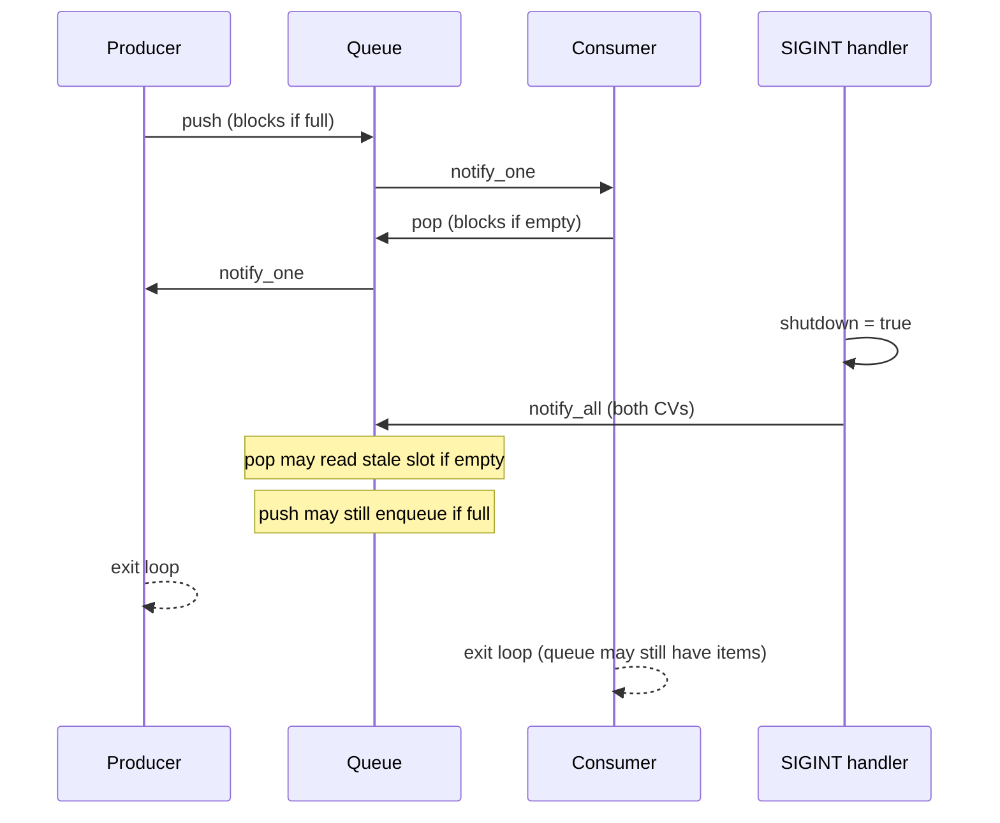

# Producer-Consumer — Review Notes

Code review feedback for the bounded-buffer producer-consumer implementation.

## What Works Well

### Ring buffer logic is correct

Using `_currIdx` and `_consumedIdx` as monotonic counters with `% _size` for storage is a clean bounded-buffer design. The occupancy checks are right:

- **Push (has space):** `_currIdx - _consumedIdx < _size`
- **Pop (has data):** `_currIdx > _consumedIdx`

### Spurious wakeups are handled

`wait` with a predicate is the correct pattern and matches the material in `09-handling-spurious-wakeups-correctly`.

### Blocking behavior is correct

Producers block when the buffer is full; consumers block when it is empty.

### Structure is clear

Separating `Queue`, `Producer`, and `Consumer` makes roles easy to follow. Using `std::jthread` for automatic join at scope exit is a nice touch.

---

## Bugs to Fix

### 1. `pop()` can return garbage on shutdown (highest priority)

**File:** `queue.hpp`

When `shutdown` is set and the queue is empty, the wait predicate becomes true (`*_isShutdown`), but the code still reads and returns a slot:

```cpp
size_t res = _arr[_consumedIdx % _size];
_consumedIdx++;
```

The consumer then prints a stale value before exiting.

**Fix:** After `wait` returns, check shutdown and whether data is actually available before consuming:

```cpp
if (*_isShutdown && _currIdx == _consumedIdx) {
    return /* sentinel, or use std::optional */;
}
```

Alternatively, change `pop()` to return `std::optional<size_t>` and have the consumer loop until it gets `std::nullopt`.

### 2. `push()` can still enqueue after shutdown

**File:** `queue.hpp`

If the queue is full and shutdown fires, `wait` returns because of `*_isShutdown`, but the code still pushes:

```cpp
_arr[_currIdx % _size] = std::move(ele);
_currIdx++;
```

**Fix:** Add an early return after `wait` when shutdown is set and the buffer is full.

### 3. No drain on shutdown

**Files:** `consumer.hpp`, `queue.hpp`

The README calls out **correct shutdown behavior**. Currently both threads exit as soon as `shutdown` is true, so items left in the queue are never consumed.

**Typical pattern:**

1. Producer stops on shutdown.
2. Consumer keeps popping until the queue is empty **and** shutdown is set.
3. Then both exit.

The consumer loop condition should be something like “queue not empty OR not shutdown,” and `pop()` must distinguish “shutdown + empty” from “real data.”

### 4. Data race on `shutdown`

**File:** `main.cpp`

`shutdown` is a plain `bool` read from multiple threads and written from a signal handler without synchronization. That is undefined behavior in C++.

**Fix:** Use `std::atomic<bool>` (with at least `memory_order_relaxed` for reads/writes).

### 5. Signal handler is not async-signal-safe

**File:** `main.cpp`

From a POSIX signal handler you may only call async-signal-safe functions. `std::cout` and `condition_variable::notify_all()` are **not** async-signal-safe.

**Fix:** Set an atomic flag in the handler and have a dedicated thread (or the main loop) perform the notifying. For a learning exercise, a simpler alternative is to skip `signal()` and stop via a timeout or `std::stop_token` on `jthread`.

---

## Design Notes

| Topic | Current choice | Alternative |
|-------|----------------|-------------|
| Condition variables | Owned in `main`, passed as pointers | Queue owns its own `not_full_` / `not_empty_` CVs |
| Shutdown coordination | Global `bool` + raw pointers | `std::atomic<bool>` or `std::stop_token` |
| API | `push` / `pop` always succeed | `std::optional`, sentinel value, or `bool try_pop(T&)` |
| Includes | `<atomic>` in `queue.hpp` but unused | Remove or use it for shutdown |

Passing condition-variable pointers from `main` works, but it couples the queue to external synchronization objects. Most production bounded buffers keep the mutex and both condition variables inside the queue class.

`std::move(ele)` on a `size_t` is a no-op; harmless but unnecessary.

---

## Shutdown Flow (Current vs Desired)



**Desired:** After shutdown, consumer drains remaining items; `push`/`pop` return early when shutdown is set and the buffer cannot proceed.

---

## Verdict

The core mechanics are solid: bounded buffer, blocking, condition variables, and predicate-based `wait`. The remaining gaps are mostly around **shutdown** — waking threads is not enough; you must decide what `push`/`pop` do after wake, drain remaining items, and synchronize the flag safely.

Priority fixes:

1. Post-`wait` checks in `queue.hpp` (`push` and `pop`)
2. Consumer loop that drains the queue on shutdown
3. `std::atomic<bool>` for the shutdown flag
4. Async-signal-safe shutdown signaling (or remove `signal()` for the exercise)
