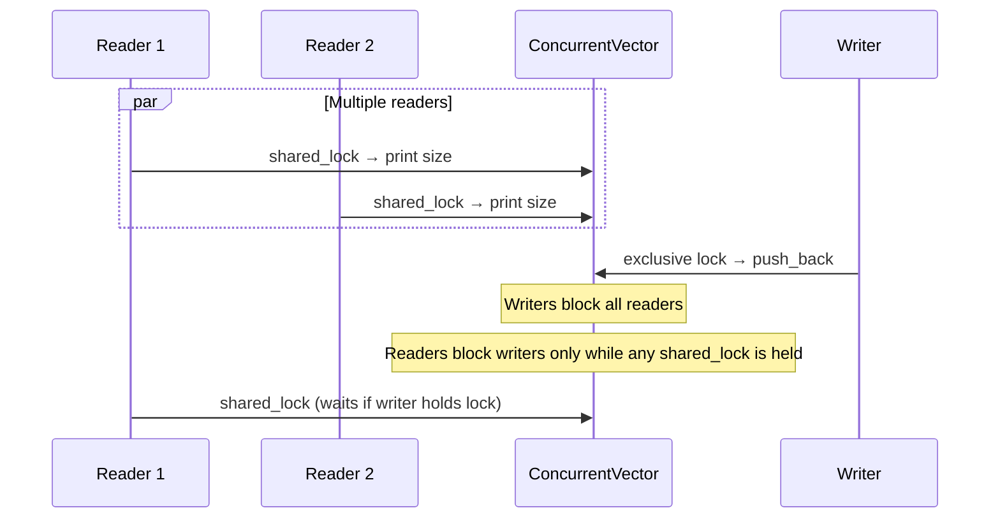

# Reader-Writer — Review Notes

Code review feedback for the `ConcurrentVector` reader-writer implementation.

## What Works Well

### Correct lock types for the pattern

`std::shared_mutex` with `std::shared_lock` for readers and `std::lock_guard` (exclusive) for writers is the right primitive for the reader-writer problem:

- **`print()`** acquires a shared lock — multiple reader threads can hold it at the same time.
- **`push()`** acquires an exclusive lock — writers block all readers and other writers.

### Structure is clear

A single `ConcurrentVector<T>` template with a private `std::vector<T>` and one `std::shared_mutex` is easy to follow. Using `std::jthread` for automatic join at scope exit matches the producer-consumer exercise.

### Vector access is synchronized

All reads and writes to `_vec` go through the mutex, so there is no data race on the container itself.

---

## Bugs and Gaps to Fix

### 1. Readers never terminate (highest priority)

**File:** `main.cpp`

All three reader threads loop forever (`while (true)`), and the writer targets `100'000'000'000` iterations — effectively unbounded. The program never reaches a clean exit on its own.

**Fix:** Add a shutdown flag (prefer `std::atomic<bool>`) or use `std::stop_token` on `jthread`. Readers should exit when shutdown is set; the writer should stop producing after a fixed count or on shutdown.

### 2. Readers do not actually read data

**File:** `concurrent_vector.hpp`

`print()` only reads `_vec.size()` under a shared lock. It never accesses elements. For a reader-writer exercise, readers should perform a real read — e.g. copy the vector, sum elements, or print a snapshot of contents.

**Fix:** Add a method such as `std::vector<T> snapshot() const` or `T at(size_t i)` that reads under `shared_lock`, and have reader threads call it.

### 3. I/O inside the critical section

**File:** `concurrent_vector.hpp`

Both `print()` and `push()` call `std::cout` while holding the mutex. Console I/O is slow and keeps the lock held longer than necessary, reducing concurrency — especially painful when many readers contend.

**Fix:** Copy or compute under the lock, release, then print:

```cpp
size_t size;
{
    std::shared_lock lock(_mtx);
    size = _vec.size();
}
std::cout << "..." << size << std::endl;
```

### 4. No starvation policy is explicit

**File:** `concurrent_vector.hpp`

The README lists **reader preference**, **writer preference**, and **starvation tradeoffs**. `std::shared_mutex` behavior is implementation-defined: on some platforms, a steady stream of readers can starve writers (reader preference); on others, writers may get priority.

**Fix (follow-up):** Implement an explicit policy with a reader count and separate condition variables, or document which policy your platform's `shared_mutex` provides and measure it.

### 5. `push` always takes exclusive lock even when vector could use `reserve`

Minor design point: every `push_back` may reallocate under the exclusive lock, extending writer hold time. For high write throughput, consider pre-allocating capacity in the constructor or a `reserve()` called once at startup.

---

## Design Notes

| Topic | Current choice | Alternative |
|-------|----------------|-------------|
| Synchronization | `std::shared_mutex` | Manual reader count + `std::mutex` + 2× `condition_variable` |
| Reader API | `print()` (size only) | `snapshot()`, `at(i)`, range-for over a copy |
| Writer API | `push(T)` | `emplace`, batch insert, in-place update |
| I/O | Inside critical section | Copy under lock, log outside |
| Shutdown | None | `std::atomic<bool>`, `std::stop_token`, or join after N writes |
| Preference policy | Implicit (OS/libc++) | Explicit reader-priority or writer-priority |

Passing a `const std::string& threadName` into `print()` couples the data structure to logging. Prefer returning data and letting `main` handle output.

`std::move(ele)` on a `size_t` is a no-op; harmless but unnecessary.

---

## Reader-Writer Flow (Current)



**Desired:** Readers perform meaningful reads; I/O happens outside the lock; threads exit cleanly after a bounded workload or shutdown signal.

---

## Follow-Up Exercises

1. **Explicit reader preference** — Track `active_readers` and `waiting_writers` with `mutex` + `condition_variable`. New readers proceed while a writer is waiting only if you choose reader priority.

2. **Explicit writer preference** — Once a writer is waiting, block new readers so the writer is not starved.

3. **Fair / FIFO policy** — Queue lock requests in arrival order (harder; often done with a single mutex protecting the policy state).

4. **Read consistency** — Return a full snapshot under one shared lock so readers see a point-in-time view, not a mix of old and new data across multiple calls.

5. **Benchmark** — Compare `shared_mutex` vs a single `std::mutex` for N readers : 1 writer with varying read/write ratios.

6. **Upgrade/downgrade** — `std::shared_mutex` does not support lock upgrade. Implement a scenario that needs it (e.g. read-then-maybe-write) and discuss why `unique_lock` + copy-on-write is often safer.

7. **Const correctness** — Mark read-only methods `const` and use `mutable std::shared_mutex` if needed.

---

## Verdict

The core idea is correct: shared locks for readers, exclusive locks for writers. The main gaps are **incomplete reader behavior** (size only), **no shutdown**, and **I/O under lock** — all fixable without changing the overall design.

Priority fixes:

1. Bounded workload or shutdown so the program terminates
2. Real read API (`snapshot` / element access) under `shared_lock`
3. Move `std::cout` outside critical sections
4. (Follow-up) Explicit reader- or writer-preference policy to match the README topics
