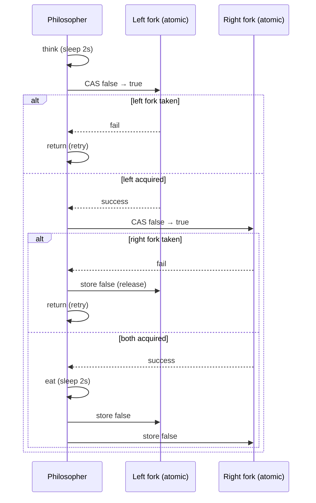

# Dining Philosophers — Review Notes

Code review feedback for the atomic try-and-backoff dining philosophers implementation.

## What Works Well

### Deadlock is avoided

The classic circular wait is broken by **not blocking** on the second fork. `compare_exchange_weak` attempts to take each fork; if the right fork is unavailable, the left fork is released before returning:

```cpp
if (!_right->compare_exchange_weak(...)) {
    _left->store(false, std::memory_order_release);
    return;
}
```

This matches the try-and-backoff pattern described in `13-deadlock-livelock-and-starvation` — no philosopher holds one fork while indefinitely waiting for the other.

### Memory ordering is intentional

CAS uses `memory_order_acq_rel` on success and `memory_order_acquire` on failure; releasing a fork uses `memory_order_release`. That is the right shape for a lock flag: acquire on take, release on give.

### Table topology is correct

Five philosophers share five forks in a ring: philosopher *i* holds `fork[i]` and `fork[i+1]` (with wrap-around). `main.cpp` wires `fork1`…`fork5` consistently.

### Structure is clear

A `Philosopher` class with `exec()` for one think–eat cycle, five `jthread`s, and shared fork state is easy to follow. `std::jthread` gives automatic join at scope exit, consistent with the other practice problems.

### Atomics instead of mutexes

Using `std::atomic<bool>` as a fork-availability flag is a valid lightweight approach and demonstrates CAS beyond `std::mutex`.

---

## Bugs and Gaps to Fix

### 1. Program never terminates (highest priority)

**File:** `main.cpp`

Every philosopher thread loops forever (`while (true)`). `main` never sets a shutdown flag, joins after a bounded workload, or requests `jthread` stop. The process only ends on external kill.

**Fix:** Add `std::atomic<bool> shutdown` or use `std::stop_token` on `jthread`. Each philosopher should exit after *N* meals or when shutdown is signaled.

### 2. Missing `#include <chrono>`

**File:** `philosopher.hpp`

`std::chrono::seconds` is used but `<chrono>` is not included. The file compiles today only because another header pulls it in transitively — that is fragile and may break with different standard library versions.

**Fix:** Add `#include <chrono>`.

### 3. Unsynchronized console output

**Files:** `philosopher.hpp`, `main.cpp`

Multiple threads write to `std::cout` without a mutex. Lines can interleave mid-string, making logs hard to read and debug.

**Fix:** Protect output with a `std::mutex`, or collect messages and print from one thread. For a learning exercise, a single `std::mutex log_mtx` around each log block is enough.

### 4. No backoff after failed fork acquisition

**File:** `philosopher.hpp`

When a fork attempt fails, `exec()` returns immediately and the outer `while (true)` calls it again. The 2-second think at the start of each cycle provides some spacing, but under contention all philosophers can still synchronize into repeated “everyone takes left, everyone fails right” cycles — **livelock** (active threads, little eating progress).

**Fix:** On failure, sleep a short random duration (`std::chrono::milliseconds` + `std::mt19937`) before retrying. This is the standard way to turn tight livelock into probabilistic progress.

### 5. `shared_ptr` for forks is heavier than needed

**Files:** `main.cpp`, `philosopher.hpp`

Forks are heap-allocated `shared_ptr<std::atomic<bool>>` objects passed by non-const lvalue reference. The philosophers do not share ownership in a meaningful way — they only need a stable pointer to each fork.

**Fix:** Use `std::array<std::atomic<bool>, 5>` (or `vector`) on the stack/heap in `main` and pass `std::atomic<bool>*` or `std::reference_wrapper` into `Philosopher`. Simpler and avoids atomic-on-heap indirection.

---

## Design Notes

| Topic | Current choice | Alternative |
|-------|----------------|-------------|
| Fork primitive | `atomic<bool>` + CAS | `std::mutex` per fork, `std::counting_semaphore` (C++20) |
| Blocking | Non-blocking try only | Block on second fork (deadlocks unless ordering/waiter used) |
| Deadlock strategy | Try-and-backoff | Resource hierarchy (ordered locking), waiter (≤ N−1 seats) |
| Fork storage | `shared_ptr<atomic<bool>>` | `array<atomic<bool>, N>` + pointers/refs |
| Shutdown | None | `atomic<bool>`, `stop_token`, or fixed meal count |
| Progress guarantee | Best-effort | Random backoff, fair waiter, or semaphore |
| Logging | Unsynchronized `cout` | Mutex-guarded log or single logger thread |

Constructor takes `std::shared_ptr<std::atomic<bool>> &left` (non-const lvalue ref). Prefer `const std::shared_ptr<...>&` or pass by value / raw pointer to the shared fork array.

`compare_exchange_weak` is appropriate here — spurious failure is harmless because the philosopher simply retries on the next call.

---

## Dining Flow (Current)



**Desired:** Bounded run or clean shutdown; jittered backoff on failure; synchronized logging.

---

## Follow-Up Exercises

1. **Resource hierarchy (ordered locking)** — Number forks 0…4; always acquire the lower-numbered fork first. Philosophers block on `mutex` instead of CAS. Prove deadlock cannot occur.

2. **Waiter / semaphore solution** — A counting semaphore with permits = N−1 (4 for five philosophers). A philosopher must acquire a permit before taking any fork, and releases it after eating. Classic Dijkstra solution.

3. **`std::mutex` + `try_lock`** — Replace atomic flags with one `std::mutex` per fork. Use `std::try_to_lock` and the same release-on-failure pattern; compare readability and performance with the atomic version.

4. **Measure livelock** — Run for 60 seconds and count meals per philosopher. Add random backoff and compare variance in meal counts.

5. **Starvation** — Under try-and-backoff, one philosopher can theoretically eat rarely. Implement the waiter solution and show more even distribution.

6. **Condition-variable variant** — A `Table` class owns fork mutexes and a `condition_variable`; philosophers `wait` until both neighbors' forks are free. Discuss why you still need ordering or a permit to avoid deadlock.

7. **Packet table / false sharing** — Place five `atomic<bool>` forks in one cache line vs padding each to 64 bytes. Measure contention (ties into `15-false-sharing-and-cache-alignment`).

8. **Bounded workload** — Each philosopher eats exactly 10 times; main prints total meals and exits. Use `std::atomic<int>` meal counters.

---

## Verdict

The core idea is sound: **non-blocking fork acquisition with rollback** avoids deadlock, and memory orders are chosen correctly for a lock flag. The main gaps are **no termination**, **possible livelock under contention** (no random backoff), and **minor hygiene** (missing `<chrono>`, heavy `shared_ptr` usage, unsynchronized I/O).

Priority fixes:

1. Bounded workload or shutdown so the program terminates
2. Random backoff after failed fork attempts
3. Add `#include <chrono>`
4. (Follow-up) Compare with waiter/semaphore or ordered-locking solutions from `13-deadlock-livelock-and-starvation`
