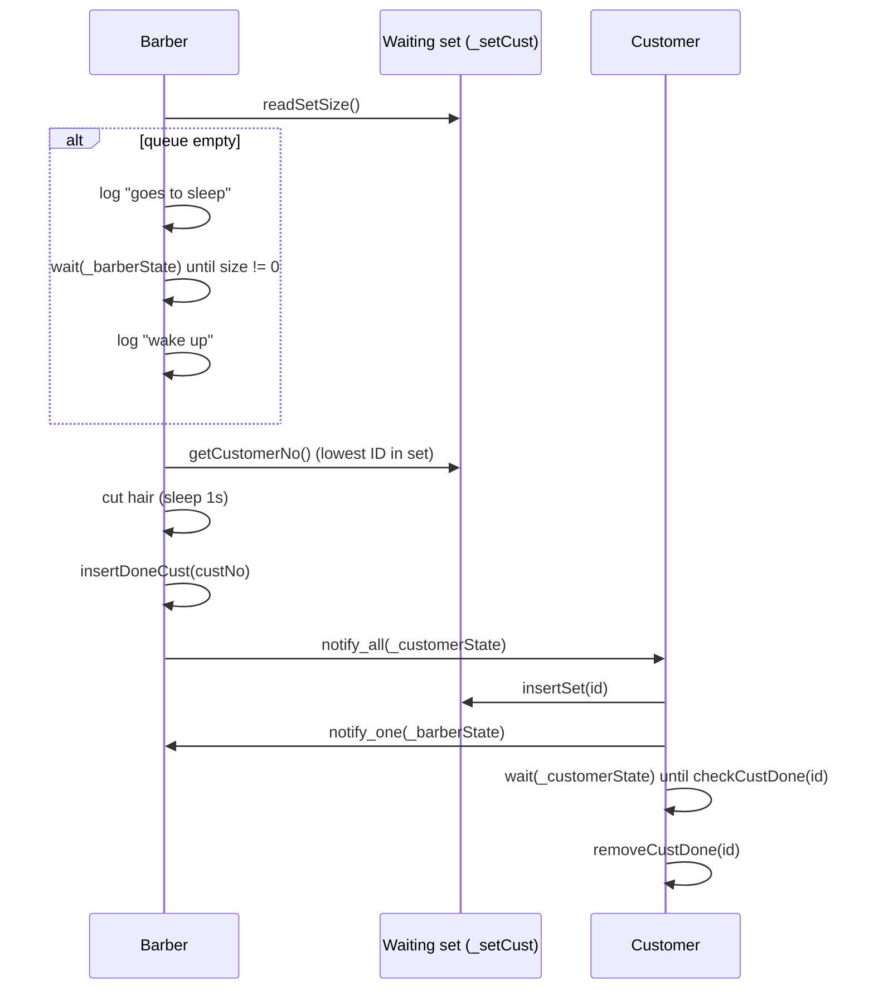

# Sleeping Barber — Review Notes

Code review feedback for the condition-variable sleeping barber implementation.

## What Works Well

### Barber sleep/wakeup logic is mostly correct

The barber blocks when the waiting set is empty and uses a **predicate** on `wait`, which handles spurious wakeups and re-checks queue size before sleeping:

```cpp
_barberState.wait(lock, [&]() {
    return readSetSize() != 0;
});
```

Customers insert into the set **before** calling `notify_one()` on `_barberState`, so the barber does not miss a wakeup due to an empty predicate at wake time.

### Customer blocking until service completes

Each customer waits on `_customerState` until its ID appears in `_doneCust`. The predicate `checkCustDone(customerNumber)` is the right shape for “block until my haircut is done.”

### Synchronized logging

Unlike some earlier practice problems, console output goes through `log()` guarded by `_logMtx`. Lines stay readable under contention.

### Role separation is clear

`exec()` for the barber and `queue()` for customers map cleanly onto the classic problem. `std::jthread` in `main.cpp` gives automatic join at scope exit.

### Mutex partitioning shows intent

Separate mutexes for the barber path (`_barberMtx`), customer completion (`_customerMtx`), waiting-room set (`_setMtx`), and done-tracking (`_setDoneMtx`) keep critical sections small and make the design easier to reason about.

---

## Bugs and Gaps to Fix

### 1. Program never terminates (highest priority)

**File:** `main.cpp`

Every thread loops forever (`while (true)`). `main` never sets a shutdown flag, caps the number of haircuts, or requests `jthread` stop. The process only ends on external kill.

**Fix:** Add `std::atomic<bool> shutdown` or use `std::stop_token`. Stop the barber after *N* haircuts or when no customers remain and shutdown is signaled; have customer threads exit when they are turned away or when shutdown is set.

### 2. No waiting-room capacity

**Files:** `barber.hpp`, `README.md`

The README lists **waiting room capacity**, but `_setCust` is unbounded. In the classic problem, only *N* customers may wait; arrivals when the room is full must leave without a haircut.

**Fix:** Track `waiting_count` (or `std::deque` size) against a `max_chairs` constant. In `queue()`, if the room is full, log and return immediately without waiting on `_customerState`.

### 3. Queue is not FIFO — `std::set` orders by customer ID

**File:** `barber.hpp`

`getCustomerNo()` takes `*_setCust.begin()`, which for `std::set<int>` is the **lowest customer number**, not the earliest arrival:

```cpp
int customerNo = *_setCust.begin();
```

With five looping customer threads, customer 5 can arrive before customer 1 is dequeued, but customer 1 is still served first whenever it is in the set. That violates fair arrival ordering.

**Fix:** Replace `std::set<int>` with `std::deque<int>` (or a `std::queue`) protected by `_setMtx`. Pop from the front after push to the back.

### 4. Missing includes (fragile compilation)

**File:** `barber.hpp`

The file uses `std::atomic<int>`, `std::format`, and `std::string` but does not include `<atomic>`, `<format>`, or `<string>`. It compiles today only because other headers pull them in transitively.

**Fix:** Add the missing includes explicitly.

### 5. Dead members

**File:** `barber.hpp`

`_currCust` and `_customerCuttinghairState` are declared but never used. They add noise and suggest incomplete design (e.g. tracking the customer currently in the chair).

**Fix:** Remove them, or wire them up if you want an explicit “barber busy / current customer” state for debugging or metrics.

### 6. `notify_all()` causes thundering herd

**File:** `barber.hpp`

After each haircut, `_customerState.notify_all()` wakes **every** waiting customer. Only one predicate matches; the rest go back to sleep. Correct, but wasteful under many customers.

**Fix:** For a small fixed set of customer threads this is acceptable. For a scalable version, use per-customer completion (e.g. `std::promise`/`std::future`, or one `condition_variable` per customer, or a monotonic ticket passed through a single completion queue).

### 7. Barber holds `_barberMtx` during the entire haircut

**File:** `barber.hpp`

`exec()` keeps the barber lock for the full `sleep_for` haircut duration. With a single barber thread this does not deadlock, but it couples “in chair” state to the mutex used for sleep/wakeup and makes it harder to extend (e.g. status queries, multiple barbers).

**Fix:** Optionally release `_barberMtx` while cutting and use a separate “barber busy” flag, or document that the lock means “barber thread is in one service cycle.”

### 8. Minor wording

**File:** `barber.hpp`

Log message uses `"it's hair"` — should be `"its hair"`.

---

## Design Notes

| Topic | Current choice | Alternative |
|-------|----------------|-------------|
| Waiting room | Unbounded `std::set<int>` | `deque` + `max_chairs`; turn away when full |
| Service order | Set order (by ID) | FIFO queue (`deque` / `queue`) |
| Barber sleep | `condition_variable` + predicate | Semaphore (customers), monitor pattern |
| Customer done signal | Shared `_doneCust` set + `notify_all` | Per-customer `future`, or one completion CV per client |
| Done-set lock | `shared_mutex` (readers on check) | Plain `mutex` — simpler at this scale |
| Shutdown | None | `atomic<bool>`, `stop_token`, or fixed haircut count |
| Logging | Mutex-guarded `cout` | Already in good shape |

`notify_one()` on `_barberState` is called while holding `_customerMtx`, not `_barberMtx`. That is allowed in C++; the barber’s predicate re-checks queue size under `_barberMtx` after wake. Holding `_barberMtx` when notifying can make reasoning easier but is not required for correctness here.

---

## Barber Flow (Current)



**Desired:** Bounded chairs with turn-away; FIFO queue; bounded run or clean shutdown; optional per-customer completion instead of `notify_all`.

---

## Follow-Up Exercises

1. **Bounded waiting room** — Add `constexpr size_t kChairs = 3`. If `readSetSize() >= kChairs`, log “customer leaves” and return without blocking. Verify turn-away under load.

2. **FIFO queue** — Replace `std::set<int>` with `std::deque<int>`. Prove service order matches arrival order in logs.

3. **Semaphore formulation** — Model customers as `counting_semaphore`: barber waits on `customers` semaphore (sleep when 0), customer signals after sitting. Compare with the mutex + two-CV design from `08-condition-variables`.

4. **Bounded workload** — Barber performs exactly 20 haircuts; all customer threads stop after being served once or turned away; `main` prints totals and exits.

5. **Shutdown** — `std::atomic<bool> shutdown` set from `main` after a timeout. Barber finishes current cut and exits; waiting customers wake and leave. Tie into graceful shutdown from `01-producer-consumer-problem`.

6. **Multiple barbers** — Extend to *M* barbers sharing one waiting room. Each barber competes for the next FIFO customer; still cap chairs at *N*.

7. **Per-customer completion** — Remove `_doneCust` and `notify_all`. Pass each customer a `std::promise<void>` or ticket ID and signal only the matching waiter.

8. **Metrics** — Count haircuts served, customers turned away, and average wait time. Print a summary when the simulation ends.

9. **`std::counting_semaphore` (C++20)** — Implement the classic Dijkstra-style solution from the literature and compare line count and clarity with your condition-variable version.

10. **Lost-wakeup drill** — Temporarily remove the `wait` predicate on the barber side and observe hangs; restore the predicate and document why it matters (links to `09-handling-spurious-wakeups-correctly`).

---

## Verdict

The core synchronization idea is on the right track: **barber sleeps on an empty shop, customers wake the barber after joining the wait structure, and customers block until their service is recorded.** Logging is synchronized, and predicate-based `wait` is used on both sides.

The main gaps are **no termination**, **no waiting-room limit** (despite the README topic), **unfair queue ordering via `std::set`**, and **minor hygiene** (missing includes, unused members, `notify_all` herd).

Priority fixes:

1. Bounded workload or shutdown so the program terminates
2. Waiting-room capacity with turn-away when full
3. FIFO queue (`deque`) instead of `std::set`
4. Add `#include <atomic>`, `<format>`, `<string>`; remove dead members
5. (Follow-up) Semaphore-based solution and per-customer completion signaling
