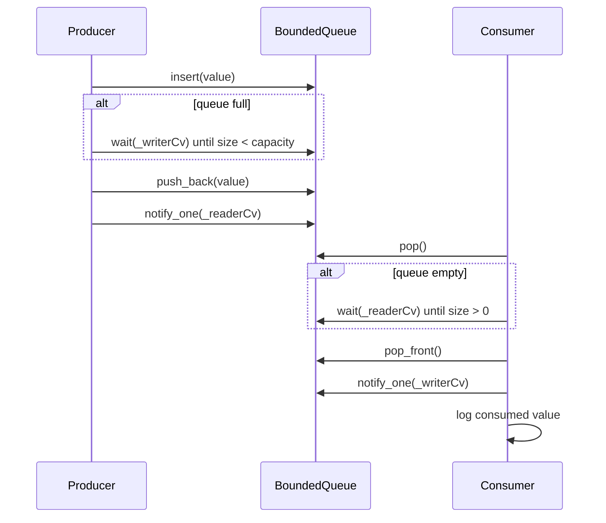

# Bounded Buffer — Review Notes

Code review feedback for the mutex + condition-variable bounded queue implementation.

## What Works Well

### Core blocking logic is correct

The buffer blocks producers when full and consumers when empty. Occupancy is checked against `_size` before waiting, and the predicates re-check after wake:

```cpp
_writerCv.wait(lock, [&]() { return _queue.size() < _size; });
_readerCv.wait(lock, [&]() { return _queue.size() > 0; });
```

This matches the pattern from `09-handling-spurious-wakeups-correctly` and handles spurious wakeups correctly.

### Two condition variables — right design choice

Separate `_readerCv` and `_writerCv` mean a producer only wakes a consumer (and vice versa). Using `notify_one()` on each side avoids waking every thread when only one can make progress. This is cleaner than a single CV for both roles.

### FIFO ordering via `std::deque`

`push_back` on insert and `pop_front` on consume gives fair first-in-first-out ordering. That is the expected semantics for a bounded buffer.

### Critical sections are minimal

The mutex is held only to check size, wait, enqueue/dequeue, and notify. No simulated work happens inside the lock — good practice.

### Template is easy to read

`BoundedQueue<T>` is a self-contained monitor with a small public API (`insert`, `pop`). The structure maps directly onto the classic bounded-buffer problem from the README topics.

### `std::jthread` in `main.cpp`

Automatic join at scope exit is a nice touch and consistent with other practice problems in this section.

---

## Bugs and Gaps to Fix

### 1. Program never terminates (highest priority)

**File:** `main.cpp`

Both the writer and reader loop forever (`while (true)`). `main` never sets a shutdown flag, caps the number of items, or requests `jthread` stop. The process only ends on external kill.

**Fix:** Add `std::atomic<bool> shutdown` or use `std::stop_token`. Stop the producer after *N* inserts or on shutdown; have the consumer drain remaining items and exit when the queue is empty and shutdown is set. See the shutdown pattern in `01-producer-consumer-problem/REVIEW-NOTES.md`.

### 2. Missing `#include <format>`

**File:** `main.cpp`

`std::format` is used but not included. The file compiles today only if another header pulls `<format>` in transitively.

**Fix:** Add `#include <format>` explicitly.

### 3. Redundant `if` before `wait` (style, not a bug)

**File:** `bounded_queue.hpp`

The outer check before `wait` is unnecessary when the predicate already encodes the condition:

```cpp
// Current
if (_queue.size() >= _size) {
    _writerCv.wait(lock, [&]() { return _queue.size() < _size; });
}

// Idiomatic — predicate covers both initial check and spurious wakeups
_writerCv.wait(lock, [&]() { return _queue.size() < _size; });
```

Same applies to `pop()`. Simplifying makes the code shorter without changing behavior.

### 4. Unsynchronized logging

**File:** `main.cpp`

`std::cout` in the reader thread is not guarded. With a single consumer this is fine today, but adding a second reader (or logging from the writer) will interleave output.

**Fix:** Route output through a mutex-guarded `log()` helper, as in the sleeping barber solution.

### 5. `BoundedQueue` is copyable by default (footgun)

**File:** `bounded_queue.hpp`

The class holds `std::mutex` and `std::condition_variable`, which are non-copyable, so implicit copy is already deleted. Move operations are also deleted implicitly. Worth making this explicit:

```cpp
BoundedQueue(const BoundedQueue&) = delete;
BoundedQueue& operator=(const BoundedQueue&) = delete;
```

Or document that the queue is a single-owner synchronization object.

### 6. Second hop into the deque still copies (minor)

**File:** `bounded_queue.hpp`

`void insert(T value)` by value is fine for moves from the caller — `insert(std::move(x))` move-constructs into `value`, not copy. The remaining nit is inside the function:

```cpp
_queue.push_back(value);  // `value` is an lvalue → copy (or second move) into deque
```

For movable `T`, use `_queue.push_back(std::move(value))` to avoid that extra copy. For `int` (your current `main`), this does not matter. A separate `insert(T&&)` overload is optional, not required, if callers use `std::move` and the body moves into the deque.

### 7. `_size` type

**File:** `bounded_queue.hpp`

`_size` is `int` while `_queue.size()` returns `size_t`. Comparisons work but mixing signed/unsigned is a mild smell.

**Fix:** Use `std::size_t` (or `std::deque<T>::size_type`) for capacity.

### 8. `main` only exercises single producer / single consumer

**File:** `main.cpp`

The README topics include **backpressure** and **blocking producers**, but with one slow writer (1 s per item) and one fast reader, the queue rarely fills. The blocking paths are hard to observe in logs.

**Fix:** Add multiple producers, a slower consumer, or burst inserts to demonstrate producers blocking when the buffer is full.

---

## Design Notes

| Topic | Current choice | Alternative |
|-------|----------------|-------------|
| Buffer storage | `std::deque<T>` | Ring buffer with modulo indices (see `01-producer-consumer-problem`) |
| Signaling | Two `condition_variable`s + `notify_one` | Single CV; or `std::counting_semaphore` (C++20) |
| Wait pattern | `if` + `wait` with predicate | Predicate-only `wait` (idiomatic) |
| Shutdown | None | `atomic<bool>`, `stop_token`, or fixed item count |
| API surface | `insert`, `pop` | `emplace`, `try_pop` → `std::optional<T>`, `size()` / `empty()` |
| Logging | Raw `cout` | Mutex-guarded `log()` |
| Concurrency demo | 1 producer, 1 consumer | N producers, M consumers under load |

---

## Bounded Buffer Flow (Current)



**Desired:** Bounded workload or clean shutdown; optional multi-producer/consumer demo; synchronized logging if scaling threads.

---

## Follow-Up Exercises

1. **Bounded workload** — Producer inserts exactly 50 items; consumer stops after the queue is drained; `main` prints totals and exits.

2. **Graceful shutdown** — `std::atomic<bool> shutdown` set from `main`. Producer stops enqueueing; consumer drains until empty + shutdown, then exits. Tie into `01-producer-consumer-problem`.

3. **Multi-producer / multi-consumer** — Launch 3 writers and 2 readers. Verify no lost or duplicate items and that producers block when full.

4. **Semaphore formulation** — Reimplement with `std::counting_semaphore`: `empty_slots` (initial = capacity) and `filled_slots` (initial = 0). Compare clarity with the mutex + two-CV design.

5. **`try_pop` / `try_insert`** — Non-blocking variants returning `std::optional<T>` or `bool` for callers that should not wait.

6. **Ring buffer** — Replace `deque` with a fixed array and modulo indices to avoid heap allocations per element.

7. **Metrics** — Track high-water mark (max occupancy), total produced/consumed, and time spent blocked. Print a summary at shutdown.

8. **Lost-wakeup drill** — Temporarily remove the `wait` predicate and observe hangs; restore it and document why it matters.

9. **Move-only types** — Test with `std::unique_ptr<int>` to confirm `insert`/`pop` work without copy.

10. **Backpressure demo** — Burst 100 inserts from one thread with capacity 10; log when the producer blocks to make backpressure visible.

---

## Verdict

The synchronization core is **solid**: mutex + two condition variables, predicate-based `wait`, `notify_one`, and FIFO `deque` storage implement the classic bounded-buffer monitor correctly. Producers block when full and consumers block when empty.

The main gaps are **no termination**, **minimal demo** (hard to see backpressure with one slow producer), **minor hygiene** (missing `<format>`, redundant `if` before `wait`, unsynchronized logging), and **API polish** (explicit deleted copies, `push_back(std::move(value))` for movable types, `size_t` capacity).

Priority fixes:

1. Bounded workload or shutdown so the program terminates
2. Add `#include <format>` in `main.cpp`
3. Multi-threaded or burst demo so blocking-on-full is observable
4. Simplify to predicate-only `wait`; add mutex-guarded logging if adding threads
5. (Follow-up) Semaphore-based solution and graceful drain-on-shutdown
