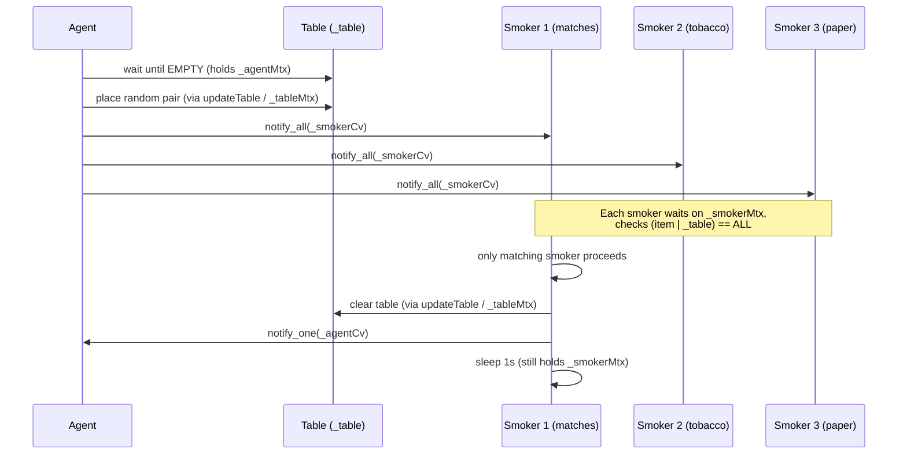

# Cigarette Smokers — Review Notes

Code review feedback for the condition-variable cigarette smokers implementation.

## What Works Well

### Bit-flag ingredient model is clear

Encoding tobacco, paper, and matches as powers of two and testing `(item | _table) == ALL` is a compact way to express “the agent’s pair plus my ingredient completes the set”:

```cpp
static const int TOBACCO = 1;
static const int PAPER = 2;
static const int MATCHES = 4;
static const int ALL = TOBACCO | PAPER | MATCHES;
```

Each smoker passes the one ingredient they own; only the smoker with the missing third piece satisfies the predicate. That maps directly onto the classic dependency structure.

### Predicate-based `wait` on both sides

Agent and smokers both use `wait` with a lambda predicate, which is the right shape for spurious wakeups and for re-checking table state after notify:

```cpp
_agentCv.wait(lock, [&]() { return _table == EMPTY; });
_smokerCv.wait(lock, [&]() { return _table != 0 && (item | _table) == ALL; });
```

This shows you understand the README topic **conditional wakeups** and the pattern from `09-handling-spurious-wakeups-correctly`.

### Notify-after-update ordering (intent)

The agent updates the table before `_smokerCv.notify_all()`, and smokers clear the table before `_agentCv.notify_one()`. That is the correct *signaling order* for avoiding missed wakeups — place state first, then wake waiters.

### Synchronized logging

Console output goes through `log()` guarded by `_logMtx`. Lines stay readable when four threads are active, consistent with the sleeping barber solution.

### Role separation maps to the problem

`exec()` for the agent and `smoke()` for each smoker are easy to follow. `main.cpp` wires three smokers with the correct complementary ingredients (matches, tobacco, paper) and uses `std::jthread` for automatic join at scope exit.

### `notify_all` for smokers is reasonable

The agent does not know which smoker has the missing ingredient, so waking all smokers and letting the predicate filter is a valid approach. Two smokers go back to sleep; only the matching one proceeds.

---

## Bugs and Gaps to Fix

### 1. Data race on `_table` (highest priority)

**File:** `agent.hpp`

`_table` is read in `exec()` and `smoke()` while holding `_agentMtx` / `_smokerMtx`, but written in `updateTable()` under `_tableMtx`. Those are **different mutexes**, so concurrent reads and writes on `_table` are undefined behavior.

ThreadSanitizer reports this immediately when the binary is built with `-fsanitize=thread`:

```
WARNING: ThreadSanitizer: data race
  Write in Agent::updateTable(int)  (mutexes: _agentMtx, _tableMtx)
  Read  in Agent::smoke(int, int)   (mutex: _smokerMtx)
```

**Fix:** Use the **monitor pattern** — one mutex protects `_table` *and* is the mutex passed to both condition variables:

```cpp
std::mutex _mtx;
std::condition_variable _agentCv;
std::condition_variable _smokerCv;
int _table = EMPTY;

void exec() {
    std::unique_lock<std::mutex> lock(_mtx);
    _agentCv.wait(lock, [&] { return _table == EMPTY; });
    // place ingredients, then notify smokers — all under _mtx
}

void smoke(int smokerNo, int item) {
    std::unique_lock<std::mutex> lock(_mtx);
    _smokerCv.wait(lock, [&] { return _table != 0 && (item | _table) == ALL; });
    _table = EMPTY;
    _agentCv.notify_one();
    lock.unlock();  // release before simulated work
    // log + sleep here
}
```

Remove `_tableMtx`, `_agentMtx`, and `_smokerMtx` (keep `_logMtx` for output). A condition variable must be used with the mutex that guards the shared state its predicate reads.

### 2. Condition variables tied to the wrong mutex

**File:** `agent.hpp`

Even aside from the race, `_agentCv` is associated with `_agentMtx` while its predicate inspects `_table`, which is updated under `_tableMtx`. `_smokerCv` has the same mismatch with `_smokerMtx`. pthread/Linux condition-variable rules require the waiting thread to hold the mutex that protects the condition being waited on.

Splitting agent lock, smoker lock, and table lock looks like **mutex partitioning for performance**, but here it breaks the monitor invariant and can lead to subtle missed-signal bugs on other platforms or under heavier contention.

**Fix:** Same as item 1 — single `_mtx` for table state + both CVs.

### 3. Simulated smoking holds `_smokerMtx`

**File:** `agent.hpp`

`std::this_thread::sleep_for(std::chrono::seconds(1))` runs while `_smokerMtx` is held. Other smokers cannot even re-check the predicate during that second. In the classic problem only one smoker acts at a time, so this does not break correctness today, but it is unnecessarily restrictive and unlike real monitor code, where work happens **outside** the lock.

**Fix:** After confirming the match and clearing `_table`, `unlock`, then log and sleep, then re-lock only if more shared-state updates are needed.

### 4. Program never terminates

**File:** `main.cpp`

All four threads loop forever (`while (true)`). `main` never sets a shutdown flag, caps the number of cigarettes, or requests `jthread` stop. The process only ends on external kill.

**Fix:** Add `std::atomic<int> cigarettes_remaining` or use `std::stop_token`. The agent stops after *N* rounds; smokers exit when shutdown is signaled and the table is clear.

### 5. `srand(time(0))` called every agent cycle

**File:** `agent.hpp`

Reseeding on every `exec()` call makes the sequence less random than it appears and is unnecessary overhead.

**Fix:** Seed once in `main` (or use `std::mt19937` + `std::uniform_int_distribution`, which is preferable to `rand()` anyway).

### 6. Redundant `if` before `wait` (style, not a bug)

**File:** `agent.hpp`

The outer check duplicates what the `wait` predicate already encodes:

```cpp
// Current
if (_table != EMPTY) {
    _agentCv.wait(lock, [&]() { return _table == EMPTY; });
}

// Idiomatic — predicate covers initial check and spurious wakeups
_agentCv.wait(lock, [&]() { return _table == EMPTY; });
```

Same applies to `smoke()`. Simplifying makes the code shorter without changing behavior.

### 7. `rand()` instead of `<random>`

**File:** `agent.hpp`

`rand()` / `srand()` are legacy C APIs with poor statistical properties and are not thread-safe if multiple agents ever existed.

**Fix:** `std::mt19937 gen{std::random_device{}};` and `std::uniform_int_distribution<int> dist(0, 2);` — either as `Agent` members or locals seeded once in `main`.

---

## Design Notes

| Topic | Current choice | Alternative |
|-------|----------------|-------------|
| Table state | Bit flags (`TOBACCO \| PAPER`, etc.) | `enum class Ingredient`; `std::optional<std::pair<...>>` |
| Synchronization | Three mutexes + two CVs + separate table lock | Single monitor mutex + two CVs (classic solution) |
| Smoker wakeup | `notify_all` on `_smokerCv` | Per-smoker CV or agent signals the one known matching smoker |
| Agent randomness | `rand() % 3` reseeded each round | `std::mt19937` seeded once |
| Wait pattern | `if` + `wait` with predicate | Predicate-only `wait` (idiomatic) |
| Work under lock | 1 s sleep inside `_smokerMtx` | Clear table, unlock, then simulate smoking |
| Shutdown | None | Fixed cigarette count, `stop_token`, or `atomic<bool>` |
| Logging | Mutex-guarded `log()` | Already good |

---

## Cigarette Smokers Flow (Current)



**Desired:** One mutex for table + CVs; smoking outside the lock; bounded run or clean shutdown; modern RNG.

---

## Follow-Up Exercises

1. **Single-monitor refactor** — Collapse to one `_mtx` protecting `_table` and both CVs. Run under ThreadSanitizer and confirm zero data races.

2. **Bounded workload** — Agent places exactly 20 random pairs; `main` prints totals per smoker and exits cleanly.

3. **Per-smoker condition variables** — Give each smoker its own CV. Agent calls `notify_one` on only the smoker who can complete the cigarette. Compare wakeup efficiency with `notify_all`.

4. **Semaphore formulation** — Model infinite supplies per smoker with three semaphores; agent `release`es two semaphores for the chosen pair; matching smoker `acquire`s all three. Compare clarity with the monitor version.

5. **Missed-wakeup drill** — Temporarily split table updates and `notify` across different locks (or notify before update) and observe hangs; restore correct ordering and document why it matters.

6. **Work outside the lock** — Refactor so table clear + agent notify happen under the lock, but logging and `sleep_for` happen after `unlock`. Measure whether agent throughput improves when smoking is slow.

7. **Explicit ingredient enum** — Replace bit masks with `enum class Ingredient { Tobacco, Paper, Matches }` and a `std::optional<std::array<Ingredient, 2>>` on the table. Discuss readability vs compactness.

8. **Stress test** — Run 10 000 rounds with ThreadSanitizer and/or Helgrind. Log any round where zero or more than one smoker claims a match.

9. **Graceful shutdown** — `std::stop_token` on each `jthread`; agent stops producing; smokers exit when stopped and the table is empty.

10. **Push smoke into `main`** — Keep `Agent` as pure synchronization; move the 1-second “smoking” simulation to the smoker threads in `main` so the monitor only coordinates ingredients.

---

## Verdict

The **problem modeling is strong**: bit flags, complementary smoker ingredients, predicate-based waits, and notify-after-update ordering show you understand agent/smoker coordination and dependency matching from the README topics.

The critical gap is **synchronization correctness**: `_table` is accessed under three different mutexes, which is a confirmed data race and violates the condition-variable monitor rule. Fixing that with a single mutex (and moving simulated work outside the lock) is the top priority.

Secondary gaps: **no termination**, **`srand`/`rand` hygiene**, **redundant `if` before `wait`**, and **holding `_smokerMtx` during sleep**.

Priority fixes:

1. Single monitor mutex for `_table` + both CVs; remove `_tableMtx` / `_agentMtx` / `_smokerMtx` split
2. Verify with `-fsanitize=thread` (zero races)
3. Release lock before the 1-second smoking simulation
4. Bounded cigarette count or shutdown so the program terminates
5. Seed once; prefer `std::mt19937` over `rand()`
6. (Follow-up) Per-smoker CVs or semaphore-based solution for comparison
